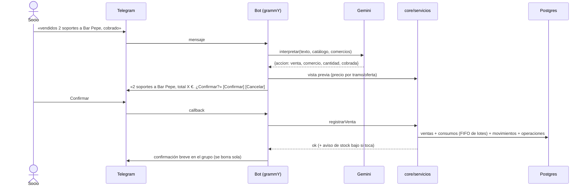
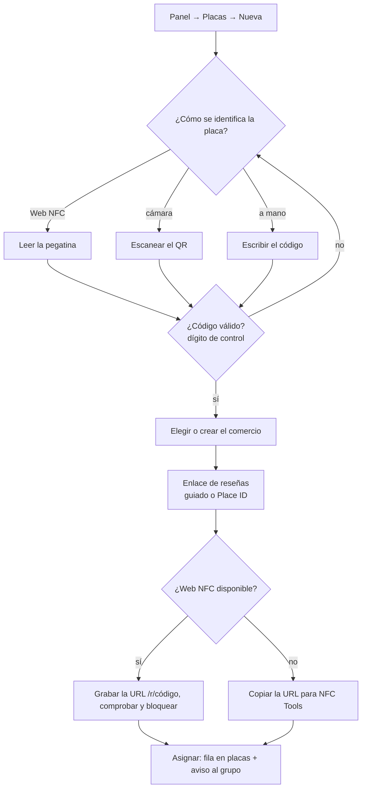
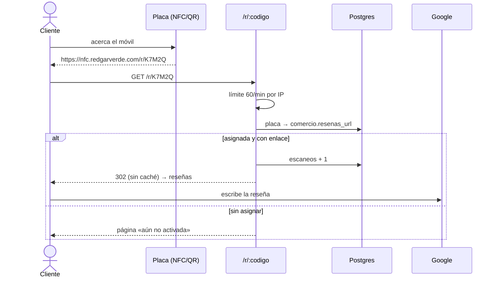
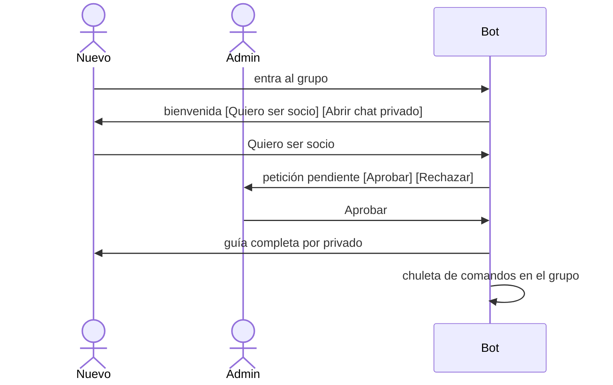
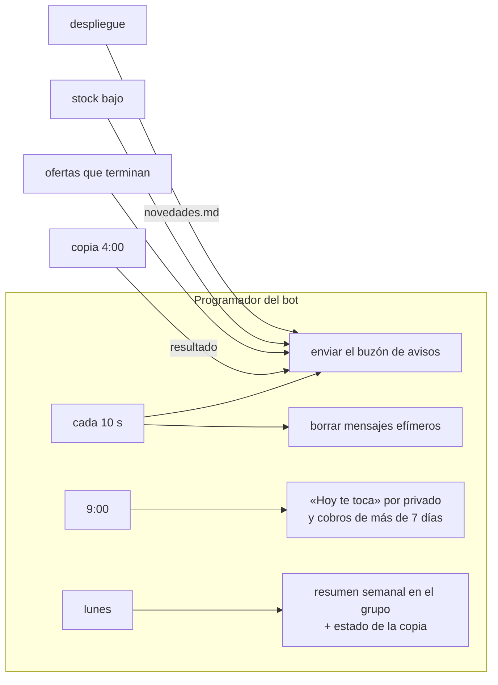

# Flujos principales

## Apuntar una venta en lenguaje natural

```mermaid
sequenceDiagram
  actor S as Socio
  participant TG as Telegram
  participant B as Bot (grammY)
  participant G as Gemini
  participant C as core/servicios
  participant DB as Postgres

  S->>TG: «vendidos 2 soportes a Bar Pepe, cobrado»
  TG->>B: mensaje
  B->>G: interpretar(texto, catálogo, comercios)
  G-->>B: {accion: venta, comercio, cantidad, cobrada}
  B->>C: vista previa (precio por tramo/oferta)
  B->>TG: «2 soportes a Bar Pepe, total X €. ¿Confirmar?» [Confirmar] [Cancelar]
  S->>TG: Confirmar
  TG->>B: callback
  B->>C: registrarVenta
  C->>DB: ventas + consumos (FIFO de lotes) + movimientos + operaciones
  C-->>B: ok (+ aviso de stock bajo si toca)
  B->>TG: confirmación breve en el grupo (se borra sola)
```

## Instalar una placa en un comercio

```mermaid
flowchart TD
  A[Panel → Placas → Nueva] --> B{¿Cómo se identifica la placa?}
  B -- Web NFC --> C[Leer la pegatina]
  B -- cámara --> D[Escanear el QR]
  B -- a mano --> E[Escribir el código]
  C & D & E --> F{¿Código válido?<br/>dígito de control}
  F -- no --> B
  F -- sí --> G[Elegir o crear el comercio]
  G --> H[Enlace de reseñas<br/>guiado o Place ID]
  H --> I{¿Web NFC disponible?}
  I -- sí --> J[Grabar la URL /r/código, comprobar y bloquear]
  I -- no --> K[Copiar la URL para NFC Tools]
  J & K --> L[Asignar: fila en placas + aviso al grupo]
```

## Escaneo de un cliente

```mermaid
sequenceDiagram
  actor U as Cliente
  participant P as Placa (NFC/QR)
  participant API as /r/:codigo
  participant DB as Postgres
  participant G as Google

  U->>P: acerca el móvil
  P-->>U: https://nfc.redgarverde.com/r/K7M2Q
  U->>API: GET /r/K7M2Q
  API->>API: límite 60/min por IP
  API->>DB: placa → comercio.resenas_url
  alt asignada y con enlace
    API->>DB: escaneos + 1
    API-->>U: 302 (sin caché) → reseñas
    U->>G: escribe la reseña
  else sin asignar
    API-->>U: página «aún no activada»
  end
```

## Alta de un socio

```mermaid
sequenceDiagram
  actor N as Nuevo
  actor A as Admin
  participant B as Bot
  N->>B: entra al grupo
  B->>N: bienvenida [Quiero ser socio] [Abrir chat privado]
  N->>B: Quiero ser socio
  B->>A: petición pendiente [Aprobar] [Rechazar]
  A->>B: Aprobar
  B->>N: guía completa por privado
  B->>B: chuleta de comandos en el grupo
```

## Avisos y tareas programadas

```mermaid
flowchart LR
  subgraph prog["Programador del bot"]
    t10["cada 10 s"] --> buzon["enviar el buzón de avisos"]
    t10 --> borrar["borrar mensajes efímeros"]
    t9["9:00"] --> dia["«Hoy te toca» por privado<br/>y cobros de más de 7 días"]
    lunes["lunes"] --> resumen["resumen semanal en el grupo<br/>+ estado de la copia"]
  end
  backup["copia 4:00"] -- "resultado" --> buzon
  ofertas["ofertas que terminan"] --> buzon
  stock["stock bajo"] --> buzon
  deploy["despliegue"] -- "novedades.md" --> buzon
```
